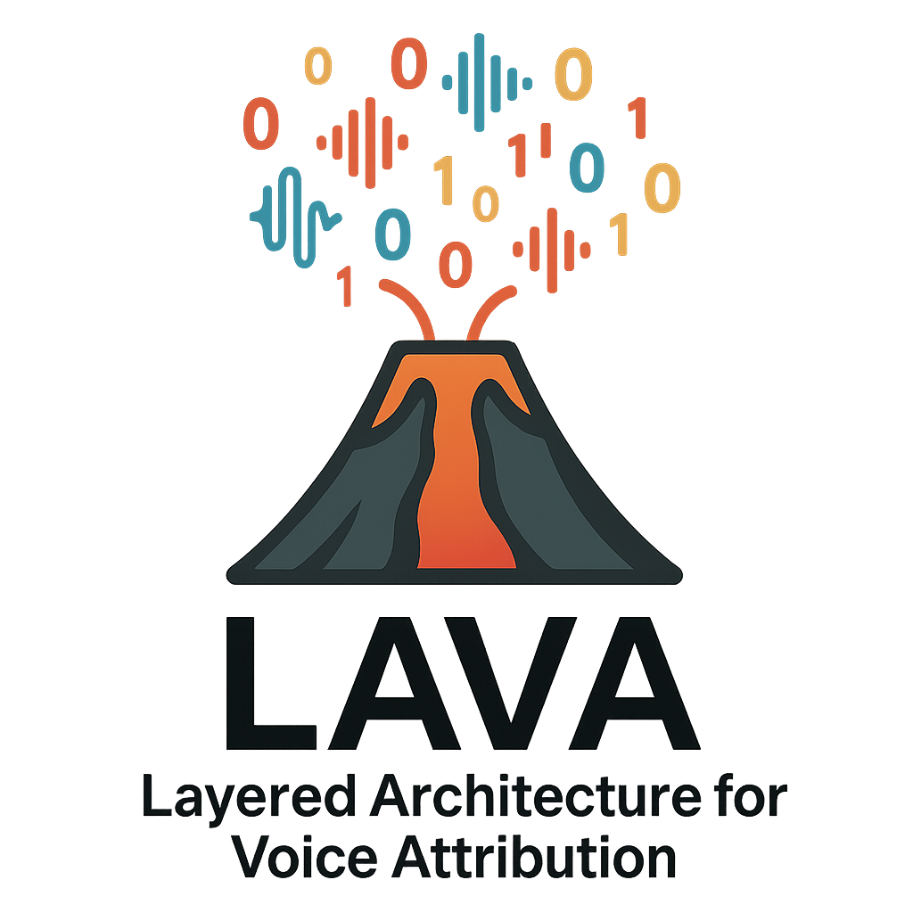

# LAVA: Layered Architecture for Voice Attribution

<p align="center">
  
</p>


This repository contains the official implementation of the paper:

> **Towards Reliable Audio Deepfake Attribution and Model Recognition: A Multi-Level Autoencoder-Based Framework**  
> *Andrea Di Pierno, Luca Guarnera, Dario Allegra, Sebastiano Battiato*  
> In Proceedings of the **DFF Workshop at ACM MM 2025**, Dublin, Ireland.

---

## 🧠 Overview

**LAVA** is a multi-level framework for **audio deepfake attribution and model recognition**, combining a shared convolutional autoencoder with attention-based classifiers.

The architecture is composed of:
- An **encoder trained exclusively on fake audio**
- A **Level 1 classifier (ADA)** for dataset-level attribution
- A **Level 2 classifier (ADMR)** for fine-grained model recognition
- A **rejection mechanism** based on prediction confidence to handle open-set inputs

The framework is evaluated across **in-domain, cross-domain, and open-set scenarios**, using the following datasets:
- [FakeOrReal](https://www.kaggle.com/datasets/mohammedabdeldayem/the-fake-or-real-dataset)
- [ASVspoof2019 LA](https://www.asvspoof.org/index2019.html)
- [ASVspoof2021](https://www.asvspoof.org/index2021.html)
- [CodecFake](https://github.com/roger-tseng/CodecFake)

---

## 📄 Paper

If you use this code, please cite our paper:

```bibtex
@inproceedings{dipierno2025towards,
  title={Towards Reliable Audio Deepfake Attribution and Model Recognition: A Multi-Level Autoencoder-Based Framework},
  author={Andrea Di Pierno and Luca Guarnera and Dario Allegra and Sebastiano Battiato},
  booktitle={Deepfake Forensics: Detection, Attribution, Recognition, and Adversarial Challenges in the Era of AI-Generated Media (DFF Workshop at ACM MM)},
  year={2025}
}
```
---
## 📂 Directory Structure

```bash
.
├── models/                          # Pretrained models
│   ├── autoencoder.pt              # Pretrained convolutional autoencoder
│   ├── ADA_model.pt                # Audio Deepfake Attribution model
│   └── ADMR_model.pt               # Audio Deepfake Model Recognition model
├── img/                            # Project assets
│   └── LAVA-logo.png              # LAVA framework logo
├── ablationStudies.py              # Ablation studies without attention mechanism
├── audioDeepfakeAttribution.py     # ADA model implementation with attention
├── audioDeepfakeModelRecognition.py # ADMR model for generation model recognition
├── autoencoder.py                  # Deep convolutional autoencoder architecture
├── fakeDataset.py                  # CodecFake dataset class with automatic labeling
├── pipeline.py                     # Complete LAVA framework pipeline
├── split_datasets.py               # Dataset splitting utilities for ADA and ADMR
├── testDataset.py                  # Error propagation and generalization testing datasets
├── tester.py                       # Testing script with error propagation analysis
├── .gitignore                      # Git ignore file
├── LICENSE                         # MIT License
├── README.md                       # This file
└── requirements.txt                # Python dependencies
```

---

## 🏗️ Architecture

The LAVA framework consists of three main components:

### 1. **Deep Convolutional Autoencoder** 🔧
- **Purpose**: Feature extraction from audio waveforms
- **Training**: Exclusively on fake audio samples for optimal representation learning
- **Architecture**: 1D convolutional layers with progressive compression (1→32→64→128→256 channels)
- **Output**: Compressed latent representations for downstream tasks

### 2. **Audio Deepfake Attribution (ADA)** 🎯
- **Purpose**: Technology-level attribution to identify the generation source of audio samples
- **Classes**: 3-way classification (CodecFake, ASVspoof2021, FakeOrReal)
- **Architecture**: Pretrained encoder + attention mechanism + classification head
- **Features**: Confidence-based rejection for uncertain predictions

### 3. **Audio Deepfake Model Recognition (ADMR)** 🔍
- **Purpose**: Fine-grained model recognition for CodecFake samples
- **Classes**: 6-way classification for different generation models
- **Architecture**: Shared encoder + attention + specialized classification head
- **Pipeline**: Only invoked for samples classified as CodecFake by ADA

---

## 🚀 Quick Start

### Prerequisites
- Python 3.10+
- CUDA-compatible GPU (recommended)
- Audio data preprocessed as PyTorch tensors (.pt files)

### Installation

1. Clone the repository:
```bash
git clone https://github.com/adipiz99/lava-framework.git
cd lava-framework
```

2. Install dependencies:
```bash
pip install -r requirements.txt
```

### Usage

#### 1. **Complete Pipeline** (Recommended)
Run the full LAVA pipeline for audio deepfake analysis:

```python
from pipeline import load_model, run_pipeline
import torch

# Load pretrained models
autoencoder_path = "models/autoencoder.pt"
ada_model, device = load_model(
    model_class=AudioDeepfakeAttributionModel,
    model_path="models/ADA_model.pt",
    autoencoder_path=autoencoder_path
)
admr_model, _ = load_model(
    model_class=ADMR_model,
    model_path="models/ADMR_model.pt", 
    autoencoder_path=autoencoder_path
)

# Run pipeline on audio tensor
audio_tensor = torch.load("path/to/audio.pt")
thresholds = [0.85, 0.90]  # [ADA_threshold, ADMR_threshold] (example)
result = run_pipeline(audio_tensor, ada_model, admr_model, device, thresholds)

print(f"Dataset Attribution: {result['ADA']}")
print(f"Model Recognition: {result['ADMR']}")
```

#### 2. **Error Propagation Testing**
Analyze how errors propagate through the pipeline:

```python
from tester import error_propagation_test, ErrorPropagationDataset
from torch.utils.data import DataLoader

# Create test dataset
test_dataset = ErrorPropagationDataset(
    for_fake_dir="/path/to/FOR/fake",
    for_real_dir="/path/to/FOR/real",
    avs_fake_dir="/path/to/ASVspoof2021/fake",
    avs_real_dir="/path/to/ASVspoof2021/real",
    codec_real_dir="/path/to/CodecFake/real",
    codec_csvfile="/path/to/csv/codecfake/test.csv"
)
test_loader = DataLoader(test_dataset, batch_size=16, shuffle=False)

# Run error propagation analysis
ada_true, ada_pred, admr_true, admr_pred, valid_mask = error_propagation_test(
    ada_model, admr_model, test_loader, device
)
```

#### 3. **Generalization Testing**
Test model performance on unseen datasets:

```python
from tester import generalization_test, GeneralizationDataset

# Create generalization dataset (ASVspoof2019LA)
gen_dataset = GeneralizationDataset(
    avs19LA_fake_dir="/path/to/ASVspoof2019LA/fake"
)
gen_loader = DataLoader(gen_dataset, batch_size=16, shuffle=False)

# Run generalization test
generalization_test(gen_loader, ada_model, admr_model, device)
```

---

## 🔁 Data Preparation

The LAVA framework expects audio data to be preprocessed as PyTorch tensors (.pt files). Each tensor should contain normalized audio waveforms ready for model input.

### Expected Data Structure:
```
/path/to/data/
├── CodecFake/
│   ├── real/     # Real CodecFake samples (.pt files)
│   └── fake/     # Fake CodecFake samples (.pt files)
├── ASVspoof2021/
│   ├── real/     # Real ASVspoof2021 samples (.pt files)
│   └── fake/     # Fake ASVspoof2021 samples (.pt files)
├── FakeOrReal/
│   ├── real/     # Real FakeOrReal samples (.pt files)
│   └── fake/     # Fake FakeOrReal samples (.pt files)
└── ASVspoof2019LA/         # For generalization testing
    └── fake/     # Unseen ASVspoof2019LA samples (.pt files)
```

### CSV Files:
For CodecFake dataset, you'll also need CSV files containing paths and labels:
```csv
path,label
/path/to/sample1.pt,1
/path/to/sample2.pt,2
/path/to/sample3.pt,6
```

---

## 🧪 Training & Evaluation

### Available Scripts

#### 1. **Dataset Splitting**
Prepare balanced train/validation/test splits:

```bash
# For ADA task (3-dataset classification)
python split_datasets.py
# Creates CSV files for ADA training with balanced sampling from all datasets

# For ADMR task (6-model classification) 
# Automatically handled within the script for CodecFake dataset
```

#### 2. **Model Training**
Train individual components:

```python
# Train Autoencoder
from autoencoder import train, DeepAutoencoder
autoencoder = DeepAutoencoder()
train(autoencoder, train_loader, val_loader, device, epochs=50)

# Train ADA Model
from audioDeepfakeAttribution import train_model, AudioDeepfakeAttributionModel
ada_model = AudioDeepfakeAttributionModel(pretrained_autoencoder)
train_model(ada_model, train_loader, val_loader, device, epochs=20)

# Train ADMR Model  
from audioDeepfakeModelRecognition import train_ADMR_model, ADMR_model
admr_model = ADMR_model(pretrained_autoencoder)
train_ADMR_model(admr_model, train_loader, val_loader, device, epochs=10)
```

#### 3. **Ablation Studies**
Compare performance with and without attention mechanism:

```python
from ablationStudies import run_task, ModelWithoutAttention

# Run ADA without attention
run_task(
    task_name="ADA_no_attention",
    num_classes=3,
    csv_dir="/path/to/csv/ADA_split/",
    model_path="/path/to/models/ADA_no_attention.pt",
    output_dir="/path/to/results/",
    label_to_zero_base=False
)
```

#### 4. **Comprehensive Testing**
Run the complete test suite:

```bash
python tester.py
```

The test script provides:
- **Error Propagation Analysis**: How ADA errors affect ADMR performance
- **Confusion Matrices**: Detailed classification performance visualization  
- **Generalization Testing**: Performance on unseen ASVspoof2019LA data
- **Metrics**: Accuracy, Precision, Recall, F1-score for both ADA and ADMR

### Evaluation Metrics

| Component | Metrics | Description |
|-----------|---------|-------------|
| **ADA** | Accuracy, F1-score, Confusion Matrix | 3-way dataset attribution performance |
| **ADMR** | Accuracy, F1-score, ROC-AUC | 6-way model recognition performance |
| **Pipeline** | Error Propagation Rate, End-to-End Accuracy | Complete system evaluation |
| **Generalization** | Zero-shot Accuracy on ASVspoof2019LA | Cross-dataset robustness |

---

## 🧠 Pretrained Models

We provide pretrained checkpoints in the `models/` folder:

| Model | Description | Input | Output | Usage |
|-------|-------------|-------|--------|-------|
| **autoencoder.pt** | Deep convolutional autoencoder trained on fake audio | Audio tensors | Latent features (256-dim) | Feature extraction backbone |
| **ADA_model.pt** | Audio Deepfake Attribution classifier | Audio tensors | Dataset labels (0-2) | Technology source identification |
| **ADMR_model.pt** | Audio Deepfake Model Recognition classifier | Audio tensors | Model labels (0-5) | Generation model identification |

---

## 🗂 Supported Datasets

| Dataset | Usage in LAVA |
|---------|---------------|
| [**CodecFake**](https://github.com/roger-tseng/CodecFake) | ADMR & ADA training, Error propagation testing, Ablation studies |
| [**ASVspoof2021**](https://www.asvspoof.org/index2021.html) | ADA training, Error propagation testing, Ablation studies|
| [**FakeOrReal**](https://www.kaggle.com/datasets/mohammedabdeldayem/the-fake-or-real-dataset) | ADA training, Error propagation testing, Ablation studies|
| [**ASVspoof2019LA**](https://www.asvspoof.org/index2019.html) | Generalization testing |

### Dataset Usage Strategy:
- **Training**: CodecFake (both ADA & ADMR), ASVspoof2021 (ADA), FakeOrReal (ADA)
- **Testing**: Balanced samples from all training datasets for in-domain evaluation
- **Ablation studies**: Balanced samples from all training datasets to validate the impact of attention mechanism
- **Error propagation**: Balanced samples from all training datasets to analyze how ADA errors affect ADMR performances
- **Generalization**: ASVspoof2019LA for cross-dataset evaluation

Please refer to the paper for detailed split information and rejection protocol.

---

## ⚖️ License

This project is licensed under the MIT License. See the `LICENSE` file for details.

---

## 📬 Contact

If you have questions or find this project useful, feel free to contact us:

- Andrea Di Pierno — [andrea.dipierno@imtlucca.it](mailto:andrea.dipierno@imtlucca.it)

---

## 📌 Acknowledgments

This study has been partially supported by SERICS (PE00000014), including its vertical project FF4ALL, under the MUR National Recovery and Resilience Plan funded by the European Union – NextGenerationEU.
